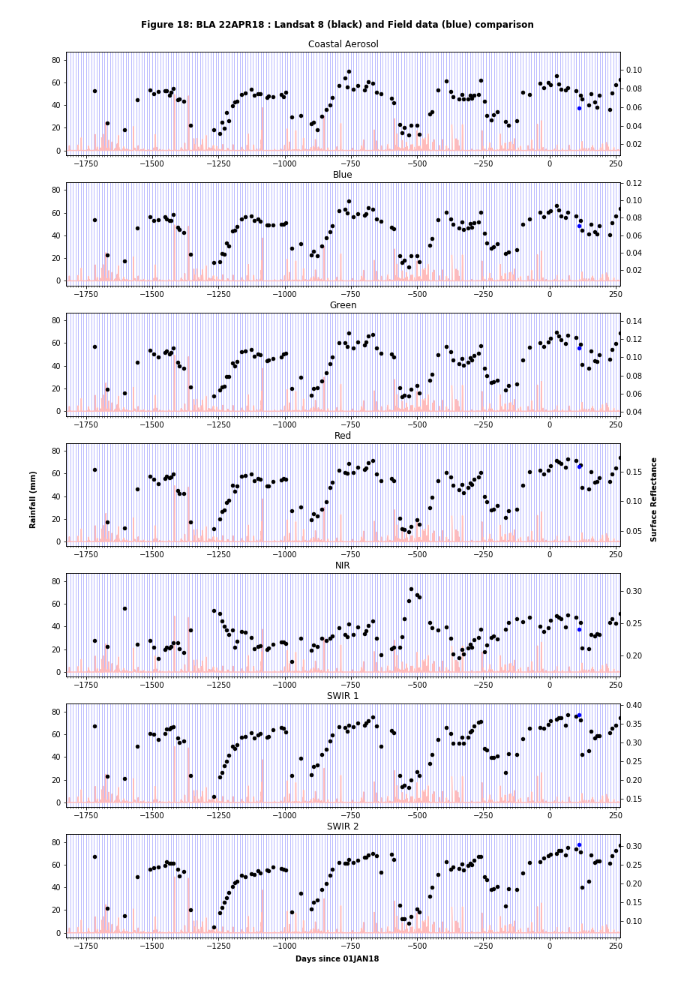
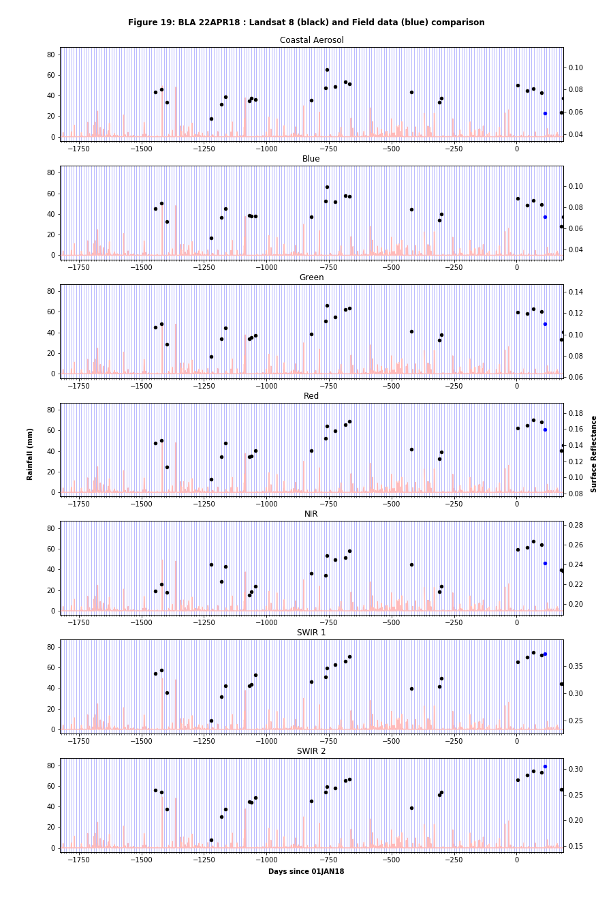

<H1>Instructions for processing MultiTimeLine workflow</H1>

This workflow follows on from the Site-Pipelines workflow. It produces a
time-series for the field site of both Landsat and Sentinel data, since the
beginning of 2013.

Multi Timelines requires code that sits in the SRC/Multi_TimeLine
subdirectory, as well as some code from the main SRC/Site_Pipelines
subdirectory.

Within the MultiTimeLine directory, there will be a template.ipynb file,
which can be used as a starting point. Copy this file and edit the first cell
as for the Site-Pipelines workflow. There are a few extra fields that need to
be filled in here:
<OL>
    <LI>The <B>Corners</B> list needs to be filled out with at least two
        coordinates (lat and long) for the site in question.</LI>
    <LI><B>ls8_csvs, sent_csvs</B>. These lists contain the name of a CSV file
        that was created in the penultimate cell of the Site-Pipelines workflow.
        The CSV file contains an output of the summary fstat_df DataFrame and
        the summary field data contained within is used to plot against the
        satellite data. In order to generate data points for both Landsat and
        Sentinel. The corresponding Site-Pipelines workflow needs to be run
        twice: once with field_data[3] set to "Landsat8" and once with
        field_data[3] set to "Sentinel2a" or "Sentinel2b". It is not necessary
        for csv files to be elements of these lists - they can be empty - but
        they must exist, even if empty.</LI>
</OL>

### Generating rainfall CSV data

Rainfall data is now automatically generated in Cell [3]. This Cell goes to the
BoM website and searches for a list of rain gauges that are closest to the
coordinates provided in the <B>Corners</B> list. The rainfall data are then
checked to make sure there are good data for at least 95% of the time, since the
beginning of 2013. If not, the next-closest rain gauge is checked, and so on.
When a suitable rain gauge is found, the rainfall data are downloaded into the
Weather directory. <B>rain_dat</B> points to the file in this directory.

### Cloud masking
There are automatic cloud mitigation strategies available for both Landsat and
Sentinel products, but in practice those built into DEA products do not result
in a satisfactory dataset, as too many good dates are flagged out and too many
bad dates remain in the final product. Instead, a cloud masking method was
developed just for this workflow.<P>

The steps to flag out cloud and cloud shadow can be summarised as:
<OL>
    <LI>Smooth data to an effective resolution fo 500m. This smooths out sharp
        lines from roads/buildings etc, as well as enhancing cloud effects,
        which are typically large-scale.</LI>
    <LI>Focus on just coastal aerosol, blue, green and red bands.</LI>
    <LI>Create a median of all data, over all time.</LI>
    <LI>Create dataset that is difference of CA/BGR data from median and search
        for large differences.</LI>
    <LI>Coarse thresholding: remove any data where difference is > 0.1 surface
        reflectance (SR) units, or where the standard deviation is larger than
        0.025 SR units.</LI>
    <LI>Based on remaining data, create new median and difference
        datasets.</LI>
    <LI>Fine thresholding: remove any data where the average SR of the field
        site is between -0.06 and 0.07. Also remove any data where any
        individual pixel within a field site shows a difference of more than
        0.07 SR units.</LI>
</OL>

Whilst this method improves upon the DEA standard method, there are still times
where good data may be flagged out, or bad data are kept in. Typically this may
happen once or twice per Multi-Timeline workflow.

### After the first run.

Once the notebook has run all the way through, you will now be able to see
satellite maps for each individual overpass.

Note that all the data
(including contaminated days) will still be shown in Cells [34-36]. However,
Cell [39] will show the summary spectra for only good satellite data. If you
see suspiciously different spectra here, it might mean you have not flagged out
all the bad data. Also Cell [40] (MultiTimeLine plots) will help any
contaminated data to stand out.

### Understanding the outputs of the workflow

The original aim of the workflow was to assess how much a field site might
change between successive satellite overpasses. It quickly became evident that
there could be large, quick changes shortly following rainfall. But that most
field sites tend to return to their original state in a matter of days. With
this in mind, the characterisation of the field sites is done in two ways:
<OL>
    <LI>Look at the change in surface reflectance between successive overpasses
        for all available data.</LI>
    <LI>Look at the change in surface reflectance between successive overpasses
        for only data where the ground could be considered as unaffected by any
        recent rain.</LI>
</OL>
In order to address the second point, the workflow uses the rainfall data to
flag out any satellite data that occurs no more than 10 days after a rainfall
event at the field site. This is a rather conservative time-scale (3-5 days
appears to be the typical timescale to return to normal), but ensures that any
remaining data should not be affected by moisture except under the most extreme
circumstances. Unfortunately, this results in some field sites without very
much dry data at all, because it rains often at the field site. In such cases,
it is wise to fall back on the full dataset, including satellite overpasses
just after rain events. This necessarily increases the variability of a field
site.<P>

Figure 18 shows an
example output for Blanchetown, using all data. The left-hand axis is rainfall
in millimetres and the right-hand axis is Surface Reflectance (SR). The faint,
grey histogram shows the amount of rainfall on a daily basis. The black dots
represent the Landsat 8 SR values. The blue dot represents the single field site
SR value. Vertical blue lines are separated by 10 days each. Blanchetown shows
a clear annual variability in all the bands. The workflow will also produce a
similar figure for Sentinel data (not shown), with green points for Sentinel 2a
and black points for Sentinel 2b. Note that data for Sentinel 2a typically only
goes back as far as 2015 and Sentinel 2b goes back as far as 2017.<P>

The workflow will also output results like the following:<BR>
```
LANDSAT 8: Number of adjacent overpasses: 113
Landsat 8 Surface Reflectance for Band 1 is 0.067+/-0.008 (12.17%)
Landsat 8 Surface Reflectance for Band 2 is 0.068+/-0.008 (11.23%)
Landsat 8 Surface Reflectance for Band 3 is 0.097+/-0.008 (8.28%)
Landsat 8 Surface Reflectance for Band 4 is 0.125+/-0.013 (10.01%)
Landsat 8 Surface Reflectance for Band 5 is 0.231+/-0.013 (5.75%)
Landsat 8 Surface Reflectance for Band 6 is 0.306+/-0.022 (7.07%)
Landsat 8 Surface Reflectance for Band 7 is 0.228+/-0.02 (8.85%)
```
These results mean that during the time period 2013-2018/October, there were
113 overpasses. For the Coastal Aerosol band, the average SR value is 0.067.
The standard deviation of the difference between successive overpasses is
0.008, which is about 12% of the SR value (0.067). This result tells us that we
can expect a variability of about 12% between successive Landsat 8 overpasses
(separated by 14 days) over the Blanchetown site, for the Coastal Aerosol band.
Statistics for the other bands are also reported.<P>

The above data are based on using ALL satellite data. However, below, we
consider only dry data. ie. the satellite overpass occurred more than 10 days
since the previous rainfall event.

Figure 19
shows the same data as previously, but with all wet data flagged out. For the
case of Blanchetown, most of the data is flagged out, since Blanchetown
regularly experiences rain. Corresponding statistics are shown below:<BR>
```
LANDSAT 8: Number of adjacent overpasses: 24
Landsat 8 Surface Reflectance for Band 1 is 0.072+/-0.007 (9.65%)
Landsat 8 Surface Reflectance for Band 2 is 0.075+/-0.006 (7.57%)
Landsat 8 Surface Reflectance for Band 3 is 0.102+/-0.005 (5.09%)
Landsat 8 Surface Reflectance for Band 4 is 0.135+/-0.006 (4.45%)
Landsat 8 Surface Reflectance for Band 5 is 0.224+/-0.007 (3.27%)
Landsat 8 Surface Reflectance for Band 6 is 0.321+/-0.007 (2.3%)
Landsat 8 Surface Reflectance for Band 7 is 0.246+/-0.006 (2.46%)
```

The number of dry-only Landsat 8 overpasses is only 24, which means the
statistics will be somewhat less reliable. However, the statistics for the
Coastal Aerosol band are slightly better than previously, with an average
SR of 0.072 and standard deviation of about 10% (difference between successive
overpasses). If there are not enough overpasses to produce reliable statistics,
then 'NaN' will be returned, as is the case for Sentinel 2b standard deviation
for Blanchetown (not shown), as there were only 4 overpasses.

